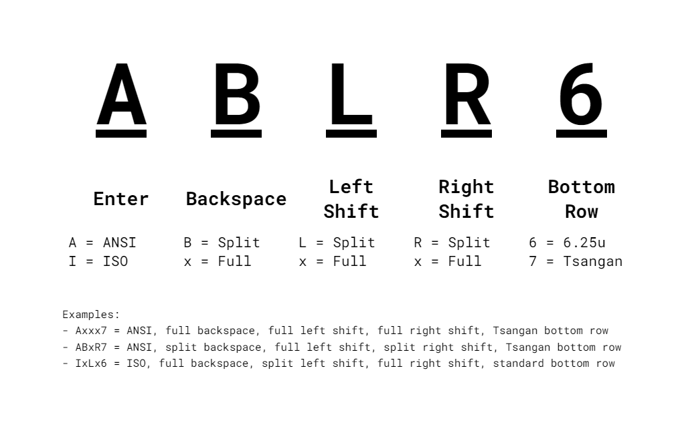

# Mona-W Configuration

This repository is for configuring the RMI-KB Mona-W PCBs that use ZMK.

## Branch Naming Convention

Branches are named as seen above. Select the appropriate branch on the upper left drop-down menu to pick your desired layout.

## Known Issues

- When you do the tweezer test and you short two pins that are not part of your layout, the top left key will actuate.

    - For example with the default layout (unified backspace), if you test the right half of the split backspace, it will send Esc. This is probably a bug with ZMK.

## Editing a keymap

1. Edit the `config/app/boards/shields/` file to change your keymap.

- https://zmkfirmware.dev/docs/behaviors/key-press
- https://zmkfirmware.dev/docs/behaviors/layers
- and pretty much everything in the "Behaviors" section, plus
- https://zmkfirmware.dev/docs/codes/

2. Head over to the Actions tab at the top of the repository.

3. Click on the latest workflow run.

- If you did your keymap correctly, there should be a green checkmark to the left.

5. Click on the firmware file to download. Unzip it somewhere too.

6. Plug the USB connector in, and double press the reset button twice quickly (Has to be <500 ms apart).

- The reset button is located underneath the left shift.

7. Drag and drop the UF2 file you unzipped to the mass storage device that appeared.
